Ejercicio
Guarda las tres salidas en tus notas y localiza la ruta de Java utilizada por Maven. Ejecuta la práctica de la lección anterior.


Ejercicio
Cambia únicamente artifactId, ejecuta mvn validate y devuelve el nombre a gestor-tareas para continuar la ruta.

#### Antes
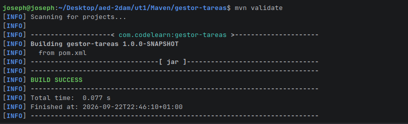

#### Despues
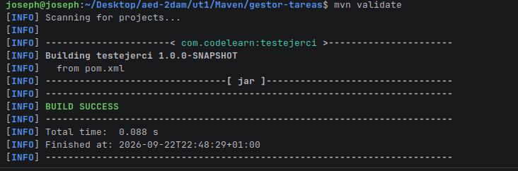


Ejercicio
Ejecuta mvn clean y comprueba que desaparece target/. Reconstruye con mvn compile y ejecuta de nuevo.

#### Antes
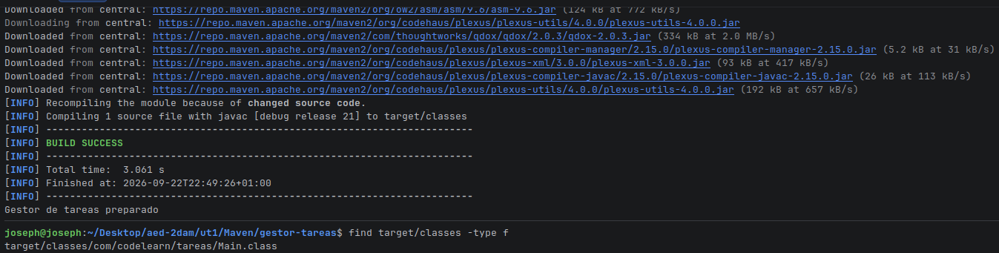

#### Despues
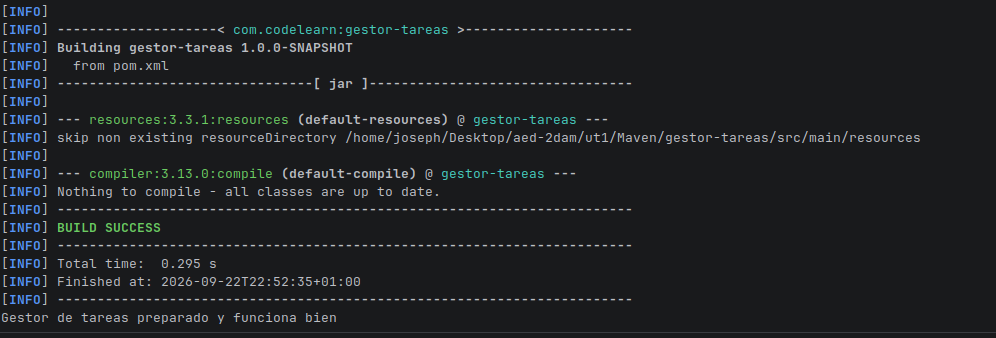


El nombre del usuario Linux, sin contraseñas.
La salida de java -version, javac -version y mvn -version con JDK 17.
La salida de las mismas órdenes con JDK 21.
El valor utilizado para JAVA_HOME en cada caso.
La evidencia de BUILD SUCCESS con JDK 21.
El error obtenido al intentar construir con JDK 17 y una explicación de su causa.
El comando utilizado para instalar la segunda versión del JDK.
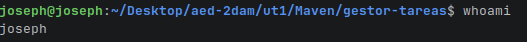

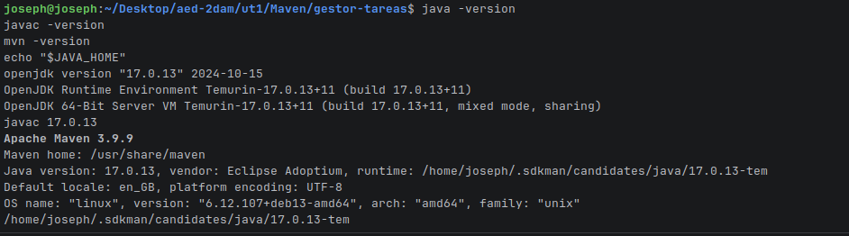

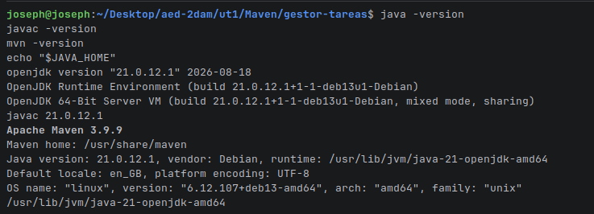

```bash
sudo apt install curl zip unzip
curl -s "https://get.sdkman.io" | bash
source "$HOME/.sdkman/bin/sdkman-init.sh"
sdk install java 17.0.13-tem
```

Ejercicio
Cambia el título y recompila. Retira temporalmente la dependencia y observa el error de compilación; después restáurala.
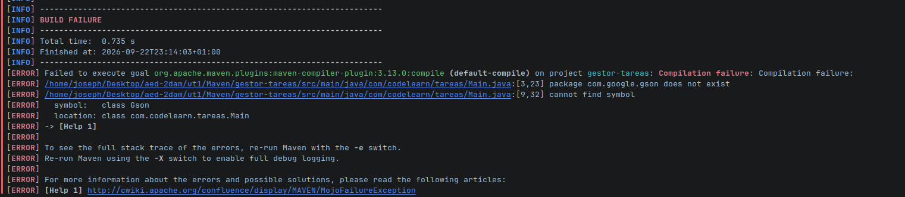


Ejercicio
Localiza el POM de Gson y el POM de tu aplicación. Explica por qué mvn install no publica el proyecto para otras personas.
porque mvn install instala el arctefacot y el pom en repositorio local

Ejercicio
Ejecuta la comprobación con y sin -Prepositorio-publico. Explica qué cambia y por qué el proyecto puede seguir descargando desde Central por defecto.

Lo que cambia es que no aparece el repositorio publico
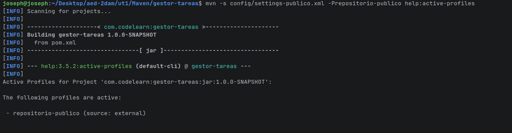

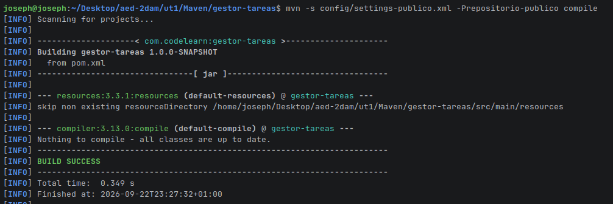

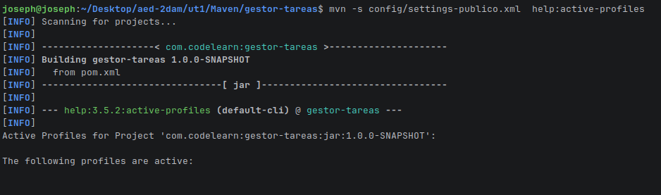

Ejercicio
Añade la activación por propiedad al perfil informe y comprueba su presencia con mvn -Dinforme=true help:active-profiles. Mantén distribucion como optativo.

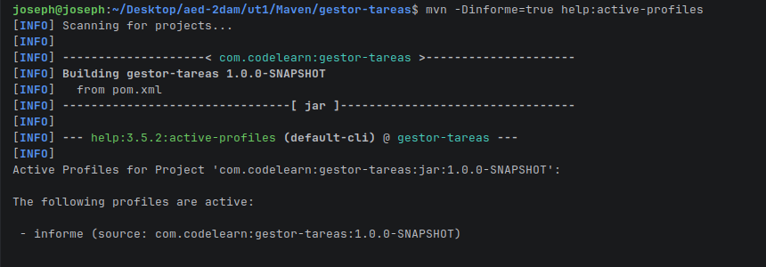

Ejercicio
Retira la declaración directa de commons-lang3 y compara el árbol. Restaura y después retira ambas dependencias de práctica para conservar el proyecto con Gson.

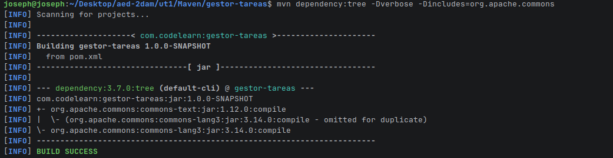

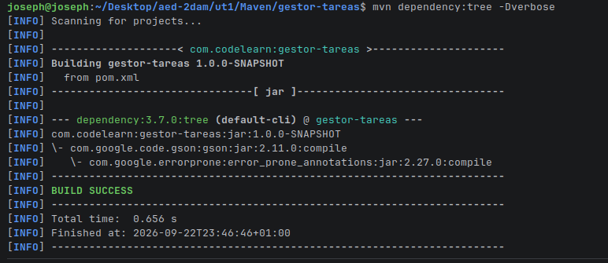

Ejercicio
Identifica en el POM efectivo de dónde salen las versiones de Gson y JUnit. No copies el POM efectivo sobre el original: es un resultado de diagnóstico.

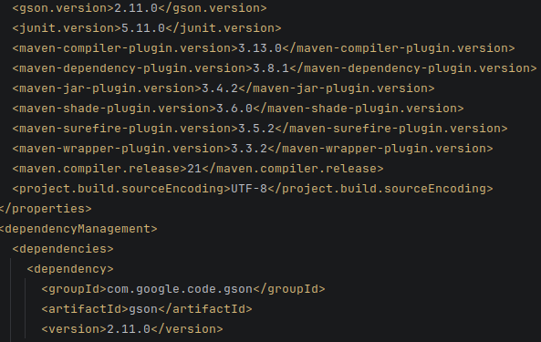
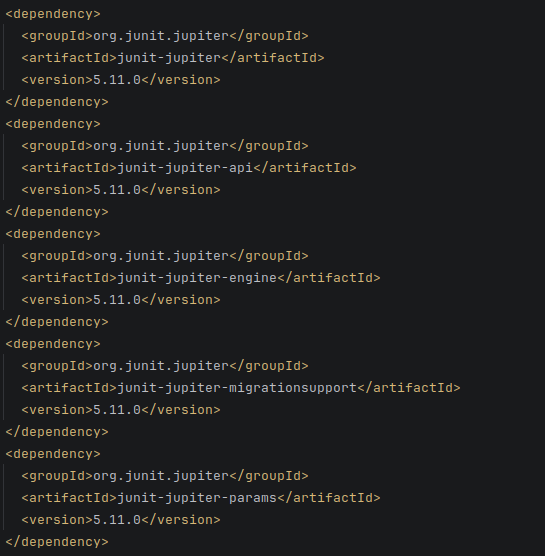
